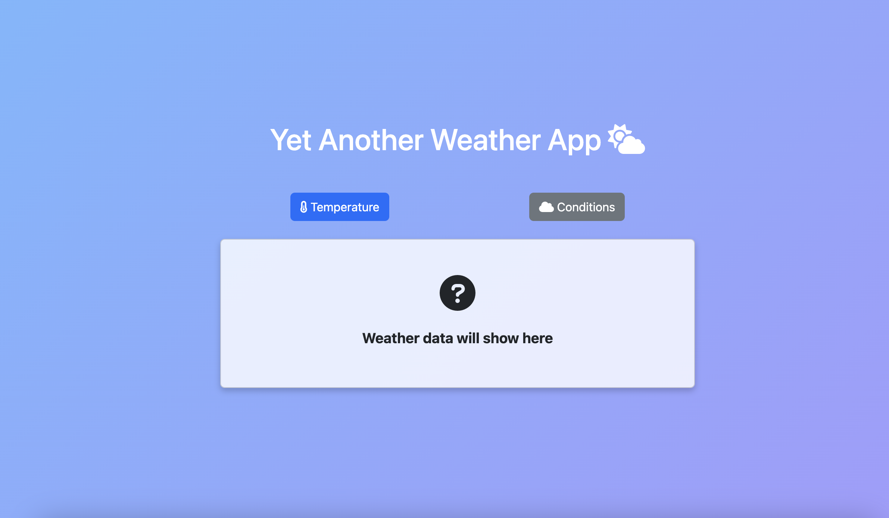

# CodeTheDream-Advanced Assignment - Yet Another Weather App
Yet another weather app for participating in CodeTheDream Advanced Pre-Work Assignment.
It displays the **current temperature** and **weather conditions** of Vancouver Island, BC.
This is just a simple weather displaying app built with Bootstrap, Vanilla Javascript, and Open-Meteo API.
API documentation here: [https://open-meteo.com/en/docs](https://open-meteo.com/en/docs)

## Features

- **Temperature and Weather Conditions:** Get the temperature and weather condition with the click of a button.
- **Clean and Responsive Design:** Uses **Bootstrap** for styling and layout.
- **Weather Icons:** Includes Font Awesome icons for better UX.


## Project Structure

```
/weather-app
│
├── index.html      # Main HTML for running this in browser
├── style.css       # Extended stylesheet for the app
├── app.js          # JavaScript for fetching weather data
├── image.png       # Screenshot of the app running in the browser
└── README.md       # Everything you need to know to understand and run this project
```


## How to run?

1. **Open `index.html`** in your preferred browser.
2. **Click the “Temperature” button** to view the temperature.
3. **Click the “Conditions” button** to view the weather conditions.


## Screenshots

